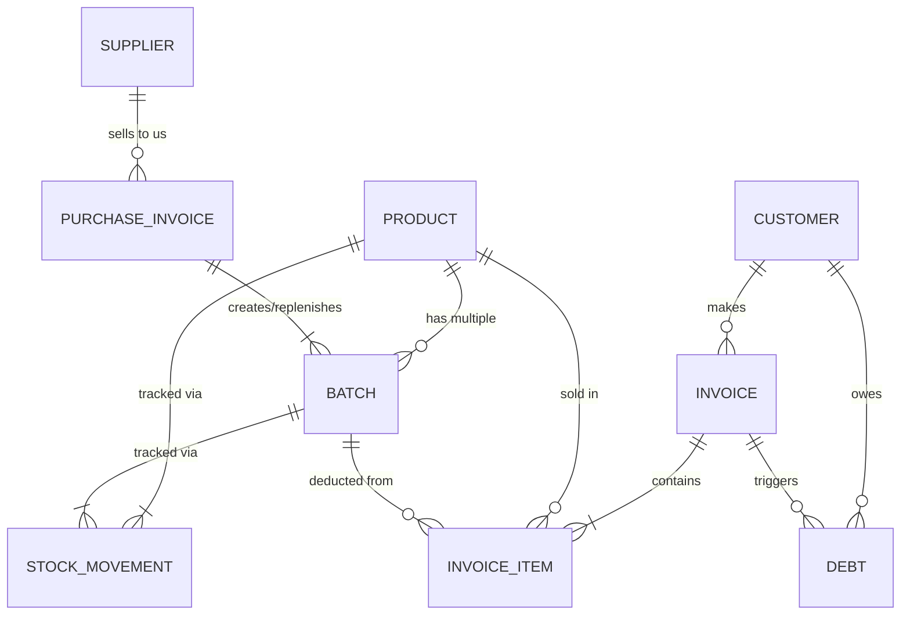

# Data Model: Entity Relationship Diagram (ERD)

This diagram defines the relationships between the core entities for the `pharmaFix` MVP as specified in `SPEC_002_Data_Model.md`.

```mermaid
erDiagram
    PRODUCT ||--o{ BATCH : "has multiple"
    PRODUCT ||--|{ STOCK_MOVEMENT : "tracked via"
    BATCH ||--|{ STOCK_MOVEMENT : "tracked via"
    
    INVOICE ||--|{ INVOICE_ITEM : "contains"
    PRODUCT ||--o{ INVOICE_ITEM : "sold in"
    BATCH ||--o{ INVOICE_ITEM : "deducted from"
    
    CUSTOMER ||--o{ INVOICE : "makes"
    CUSTOMER ||--o{ DEBT : "owes"
    INVOICE ||--o{ DEBT : "triggers"
    
    SUPPLIER ||--o{ PURCHASE_INVOICE : "sells to us"
    PURCHASE_INVOICE ||--|{ BATCH : "creates/replenishes"
```
