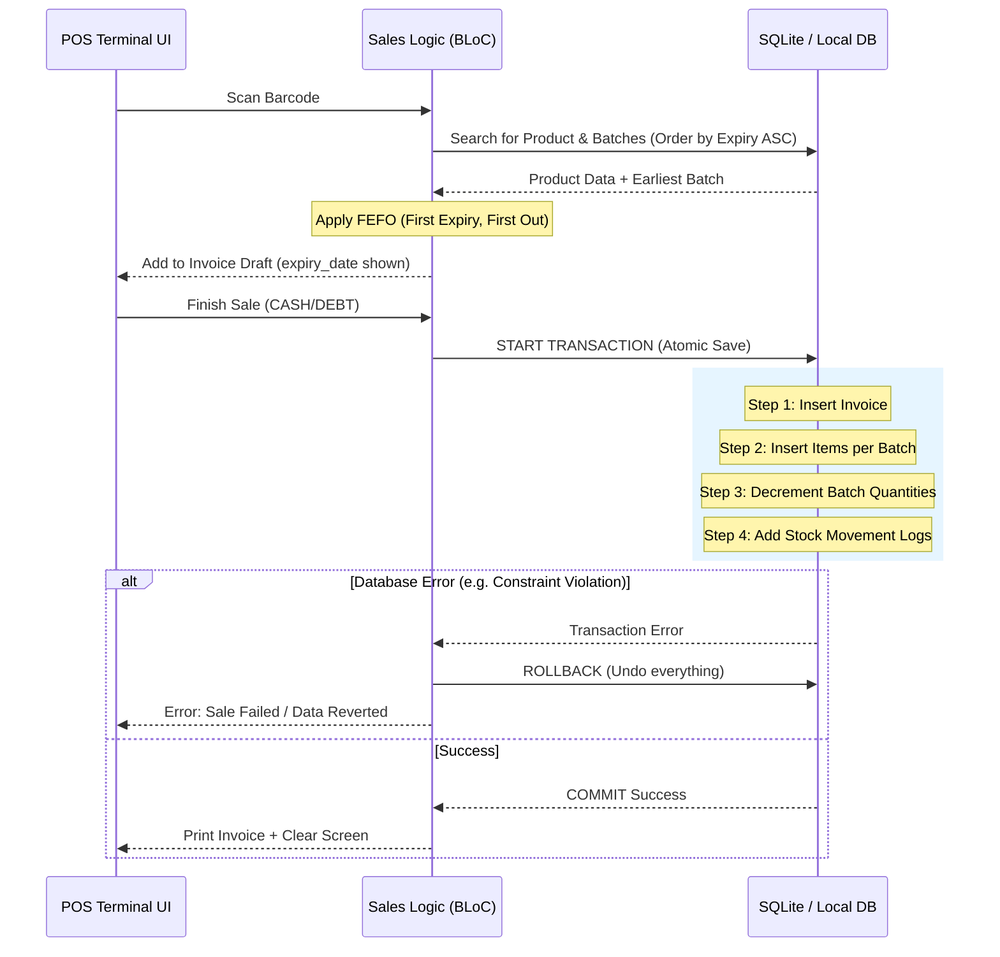

# POS Transaction: Sequence & Rollback

This sequence diagram illustrates the interaction between the POS UI, logic layer, and database for a secure pharmacy sale as specified in `SPEC_003_POS_Transaction_Flow.md`.

