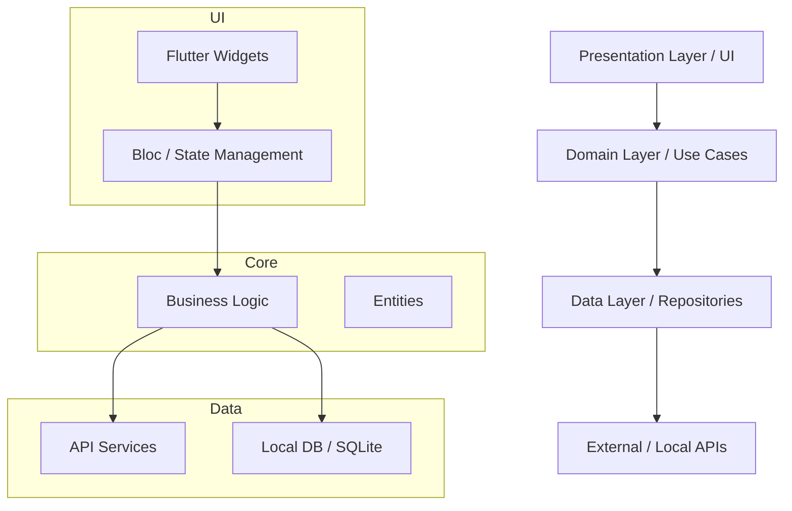

# Project Structure Overview (Visual)

This diagram shows the relationship between the different layers of the `pharmaFix` project according to the **Clean Architecture** principles.

```mermaid
graph TD
    A[Presentation Layer / UI] --> B[Domain Layer / Use Cases]
    B --> C[Data Layer / Repositories]
    C --> D[External / Local APIs]
    
    subgraph UI
        A1[Flutter Widgets]
        A2[Bloc / State Management]
    end
    
    subgraph Core
        B1[Business Logic]
        B2[Entities]
    end
    
    subgraph Data
        C1[API Services]
        C2[Local DB / SQLite]
    end

    A1 --> A2
    A2 --> B1
    B1 --> C1
    B1 --> C2
```
